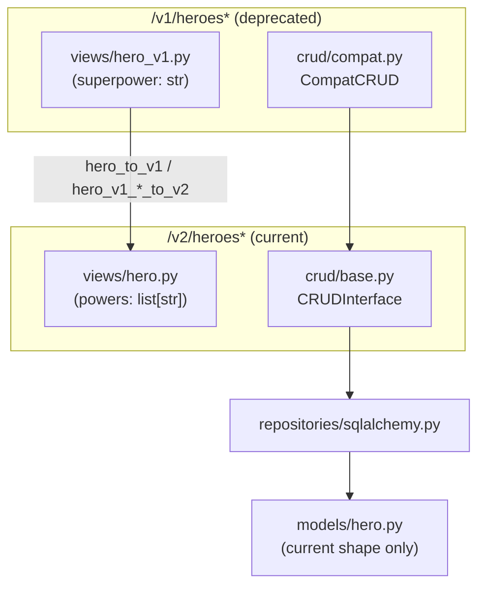

# 0002. Version the Hero API by URL path prefix, keeping the DB model unversioned

## Status

Accepted

## Context

`2026-09-hero-v2-powers-field.md` changed Hero's `superpower: str` field
to `powers: list[str]` -- a breaking shape change for any existing
client. The template needed a repeatable answer for "how does a
resource's API evolve without breaking existing callers", not just a
one-off fix for Hero, since a template's purpose is to make the *next*
breaking change cheap too (see `0001`'s "cheap to add the next one"
framing).

Three places to put the compatibility layer were on the table. First,
inside the existing `/heroes` routes, branching on an `Accept` header or
a query parameter -- no new routes, but every route body grows a
conditional, and the conditional only multiplies with each further
version. Second, a second SQLAlchemy model/table holding the old shape,
kept in sync with the current one -- avoids the current model gaining
compatibility fields, but introduces dual writes and a real
synchronization problem for no benefit, since the old shape is always
derivable from the new one. Third: a path-prefixed sibling API version
(`/v1/heroes`, `/v2/heroes`), backed by the *same* repository/model as
the current version, with a views-layer conversion function bridging the
two shapes. The third was chosen: `/vN` prefixes are simple, explicit,
and browsable directly in Swagger UI (each version gets its own tag
group), and the persistence side needs no new infrastructure -- only a
views module and a thin controller per deprecated version.

## Decision

We will version the Hero API by URL path prefix: `/v2/heroes*` is the
current shape, `/v1/heroes*` is a deprecated sibling kept working
against the same data. There is no bare unversioned `/heroes` alias --
callers pick a version explicitly.

The database model (`models/hero.py`) always represents the *current*
shape only, never a specific API version's shape -- versioning is a
`views` + `crud` concern, not a `models` concern. A deprecated version's
views module (`views/hero_v1.py`, following a `*_vN.py` naming
convention) defines that version's Pydantic shape plus pure,
side-effect-free converter functions to and from the current version's
views (`hero_to_v1`, `hero_v1_create_to_v2`, `hero_v1_update_to_v2`).
Conversion lives in the views layer specifically because it's pure --
no I/O, no dependency on a repository or session -- so it's trivial to
unit test each conversion function in isolation from the HTTP layer
entirely.

`crud/compat.py`'s `CompatCRUD` is a generic wrapper, parameterized by a
legacy schema, the current schema, and a model type, that adapts any
`CRUDInterface` to speak in terms of an older view via caller-supplied
converter functions. It is not Hero-specific -- the same class wraps
any future resource's next deprecated version, so the *n*-th deprecated
version costs a views module and a thin controller (mirroring the
current version's router, swapping in the `*_vN` views and a
`CompatCRUD`-wrapped dependency), never new CRUD or repository
infrastructure.

A deprecated version's router applies `app.http_headers.sunset(...)` as
a router-level dependency, so every route under it advertises
`Sunset`/`Deprecation`/`Link` headers (RFC 8594) at once, pointing at
the current version's path -- one declaration per deprecated version,
not one per route.

There is exactly one persisted shape (`models/hero.py`); every API
version is a `views`/`crud` adapter on top of it, never a second table.

## Consequences

Adding a resource's first deprecated version is now a views module
(shape + three converter functions) and a controller module per
format (JSON/XML/web) that mirrors the current version's, rather than a
bespoke migration each time -- the intended payoff. The cost is that a
lossy conversion (here, `hero_to_v1` picking `powers[0]` as the v1
`superpower`) has to be a deliberate, documented choice at the views
layer, and every future breaking field change needs the same treatment:
a new `*_vN.py` views module, not just a model migration.

Because the model never carries a specific API version's shape, a
resource's `models/` and `repositories/` code stays exactly as simple as
if there were only one API version -- the compatibility cost is
isolated to `views/` and a thin `crud/compat.py`-wrapped controller,
never touching persistence. The trade-off is that a deprecated version's
behavior is only as correct as its converter functions: `CompatCRUD`
itself has no way to verify a conversion is lossless or even sensible,
so each `*_vN.py` module needs its own unit tests covering the
lossy/edge cases explicitly (see `tests/unit/views/test_hero_v1.py`).

Keeping the DB model unversioned also means a deprecated version can
only ever be a *view* onto current data -- it can't represent a shape
the current model can't already produce. That's a deliberate constraint
matching this app's needs (there's never a reason to persist the old
shape separately), not a general solution: a resource that genuinely
needs to persist multiple historical shapes independently would need a
different design.
