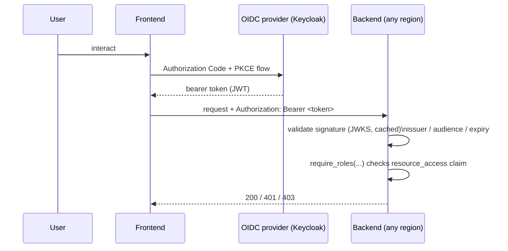
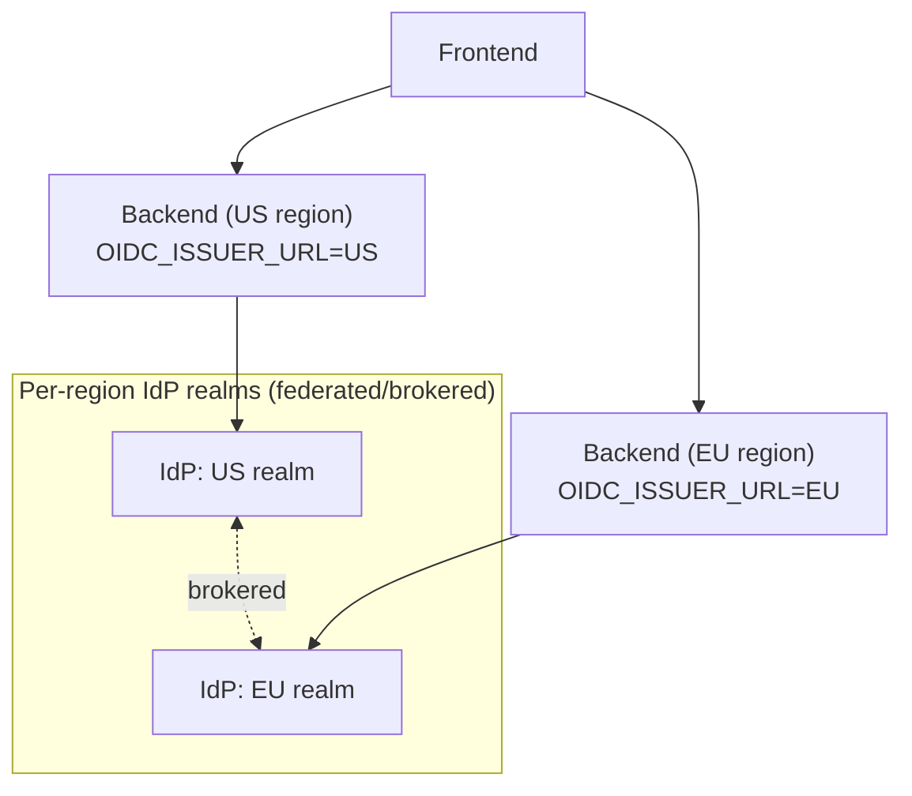

# 0003. Enforce authorization server-side, per backend, and let that pattern federate across regions unchanged

## Status

Accepted

## Context

`src/app/oidc.py` already validates bearer tokens per-request
(`get_current_claims`, `require_roles`) via OIDC discovery + JWKS
(`PyJWKClient`, `@lru_cache`d), independent of any particular frontend —
provider-agnostic authentication, with `require_roles` reading Keycloak's
specific `resource_access.<client>.roles` claim shape for authorization.
The open question was whether authorization should instead live in the
frontend (with the backend trusting it), and — separately — how either
answer generalizes if this backend becomes several regional deployments
(US/EU/Asia) behind one shared frontend.

## Decision

We will keep authorization enforcement server-side, per backend, exactly
as already implemented. A frontend-side check is bypassable by any client
that calls the API directly (a compromised browser, a script, a second
frontend), so it can only ever be a UX convenience layered on top — e.g.
decoding the JWT client-side to hide a button the user has no role for —
never the actual enforcement point. The frontend's real job is narrower:
run the OIDC Authorization Code + PKCE flow to obtain a token (this
repo's Keycloak realm already configures `api` as a public client for
exactly this), then attach that token as `Bearer` to whichever backend it
calls.

This already generalizes to a federated multi-region backend without any
change to `oidc.py`, because token validation is stateless and local:
each backend fetches/caches the issuer's JWKS itself and checks
signature + `iss`/`aud`/expiry on every request, with no per-request call
back to the identity provider and no calls between backends. There is no
central "auth service" any request has to hop through — every region
validates independently. What genuinely varies by region is *identity
issuance*, not authorization logic:

- **One global IdP realm**, trusted by every regional backend. Simplest
  to operate; the tradeoffs are a single blast-radius region for the IdP
  itself and possible latency for users far from wherever it's hosted.
- **Per-region IdP realms, federated/brokered together** — needed if
  data-residency rules (e.g. GDPR) require EU users' identity records to
  live in the EU. Keycloak supports this via identity brokering (one
  realm trusts another as an external IdP) without the resource-server-
  side code changing at all.

Either way, `oidc.py`'s pattern — validate issuer + audience + JWKS
locally, enforce roles per-route via `require_roles` — stays
byte-for-byte identical in every region; only the `OIDC_ISSUER_URL`
setting differs per deployment.

No request ever hops through a central auth service — each backend
validates independently against its own configured issuer.

## Consequences

A frontend can call multiple backends (regional or otherwise) using the
same token, with no per-backend login, as long as every backend trusts
the same issuer or a federated set of issuers. Standing up a new region
means deploying the existing `src/app` unchanged with a different
`OIDC_ISSUER_URL` (and standing up or brokering into that region's IdP
realm) — no new code path, no gateway/BFF layer required for auth
specifically. The cost this pushes elsewhere: keeping role/claim meaning
consistent across realms (e.g. "`maintainer`" meaning the same thing in
every region's `api` client roles) becomes a governance responsibility
for whoever administers the IdP realms, not something the backend code
can verify or enforce on its own.
