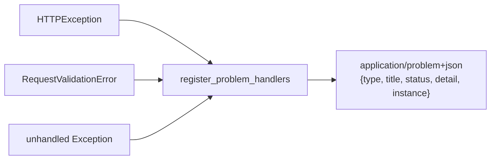

# 0004. Render every error as an RFC 9457 problem-details response

## Status

Accepted

## Context

FastAPI's defaults give three different error shapes depending on
source: a raised `HTTPException` returns `{"detail": ...}`; a request
validation failure returns `{"detail": [...]}` with a different
internal structure; an unhandled exception returns a bare, undocumented
500 with no body shape guarantee at all. A generic template's CRUD,
XML, and web-form routes (see `docs/adrs/0001-...md`) all raise errors
through the same few paths (`HTTPException`, Pydantic validation), so
whichever shape is picked has to work identically across every format
a route can return, not just JSON.

The alternative to a single global shape was letting each router (or
each format-specific router factory — JSON/XML/web) format its own
errors. That would have meant either duplicating error-formatting logic
three times per resource, or leaking FastAPI's inconsistent defaults
straight through to API consumers with no single documented contract
to code against.

## Decision

We will register global exception handlers (`problem_details.
register_problem_handlers(app)`, called once from `main.py`) that turn
every `HTTPException`, every `RequestValidationError`, and any other
unhandled exception into one consistent `application/problem+json`
body (RFC 9457: `type`, `title`, `status`, `detail`, `instance`). A
route never builds this shape itself — raising a plain `HTTPException`
(as every existing route already does) is enough.

An unhandled exception's `detail` is redacted to a generic "Internal
Server Error" under `MODE=mock`/`production`, and only includes the
real exception message under `MODE=dev` — so a bug's internals are
visible to a developer locally but never leaked to a real caller.

## Consequences

Every route — JSON, XML, or web-form, current or deprecated version —
returns errors in one documented shape, so an API consumer writes one
error-handling code path instead of one per format. The cost is a
small layer of indirection: a route that wants a specific `detail`
message still raises `HTTPException` normally, but the actual response
body is assembled somewhere the route never sees, which a new
contributor has to discover once (`problem_details.py`) rather than at
every route.

Redacting exception detail outside `MODE=dev` means a production bug's
exact message never reaches logs a caller can see — but it is still
visible in the app's own structured logs (see
`docs/adrs/0007-structured-json-logging-only.md`), so this doesn't cost
observability, only external leakage.
