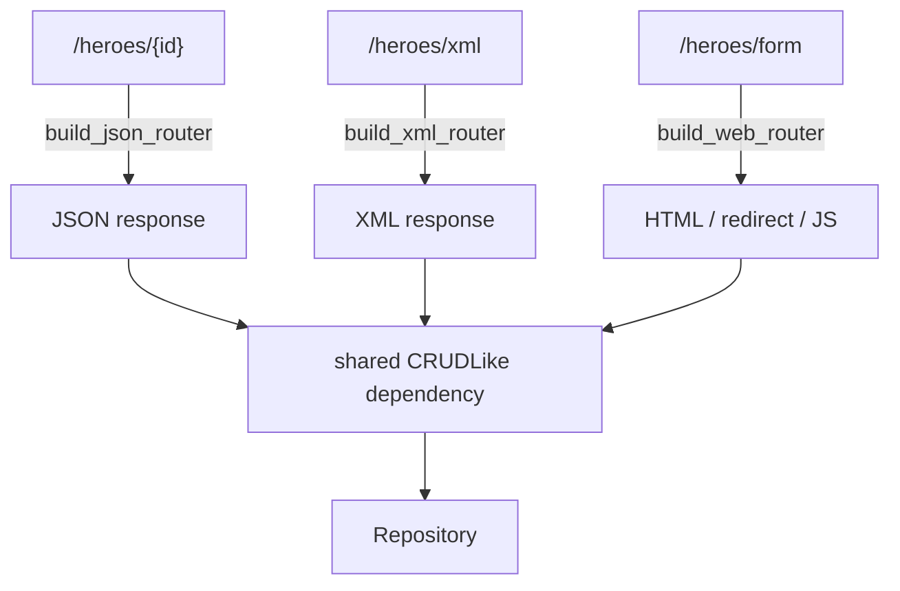

# 0005. Serve XML and HTML/web-form representations as sibling routers, not content negotiation on one route

## Status

Accepted

## Context

The template needed to demonstrate that a resource's CRUD operations
aren't inherently JSON-only: an XML representation for consumers that
need it, and a zero-JavaScript HTML form for a browser to use directly
without a SPA framework. Two designs were on the table. The first: one
set of routes per resource, branching internally on the `Accept`/
`Content-Type` header to decide whether to (de)serialize JSON, XML, or
form-encoded data — fewer routes, but every route body grows a format
branch, and the branch multiplies with each further format. The
second: separate sibling routes per format (`/heroes`, `/heroes/xml`,
`/heroes/form`), each built by its own generic router factory
(`build_json_router`/`build_xml_router`/`build_web_router` in
`controllers/crud_router.py`), sharing the same underlying
`CRUDInterface`/`CRUDLike` dependency.

The second was chosen: it keeps each format's (de)serialization code
(`xml_codec.py`, `web_components.py`) fully separate from the others,
each format's routes are independently visible and documented in
Swagger UI as distinct paths, and — critically for a template — a new
resource opts into exactly the formats it needs (most will want only
`build_json_router`) rather than every route always branching on a
header whether or not that resource ever needs a second format.

## Decision

We will expose additional representations of a resource as sibling
routes under the same resource path (`/heroes/xml`, `/heroes/form`,
`/heroes/components.js`), built by dedicated, resource-agnostic router
factories in `controllers/crud_router.py`, rather than by content
negotiation inside one route. Each factory is parameterized by the
resource's Pydantic views and an already-built `CRUDLike` dependency —
the same dependency a `build_json_router`-built route uses — so adding
a format to an existing resource never touches persistence or the
resource's core CRUD wiring.

Because `build_xml_router`/`build_web_router`'s routes construct and
return their own `Response`/`RedirectResponse` directly (XML bodies,
form redirects, JS bodies), any router-level header dependency (e.g.
`http_headers.sunset(...)`, see `docs/adrs/0002-...md`) must be
explicitly merged in via `crud_router.py`'s `_with_dependency_headers`
— FastAPI only auto-merges dependency headers into its own
framework-built responses, not into one a route builds itself.

## Consequences

Adding an XML or web-form representation to a future resource is one
extra `build_xml_router(...)`/`build_web_router(...)` call against the
same `CRUDLike` dependency already built for JSON — not a rewrite of
existing routes. The cost is more routes per resource (up to three
sibling paths instead of one), each independently listed in the
OpenAPI schema, and one narrow, easy-to-miss failure mode:
`_with_dependency_headers` must be called by every hand-built response
in `build_xml_router`/`build_web_router`, or router-level headers
(Sunset/Deprecation) silently vanish on exactly those routes — this
already happened once, on `heroes_v1_xml.py`/`heroes_v1_web.py`, before
the helper was introduced (see `controllers/README.md`).

Because each format shares the same `CRUDLike` dependency, none of the
three can drift in what data they expose or what validation they
apply — the format layer is purely a (de)serialization concern, never
a second copy of business logic.
