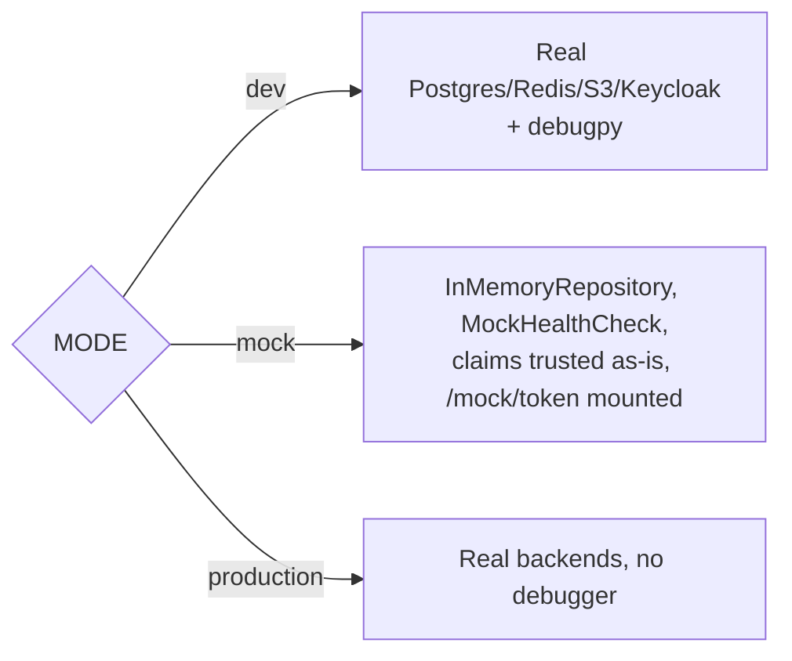

# 0006. Drive every infrastructure fake from one MODE setting, and make the async engine survive tests mixing event loops

## Status

Accepted

## Context

A devcontainer-based stack (Postgres, Redis, S3, Keycloak) is the
template's normal way to run the app, but requiring every contributor
and every CI job to have all four running just to execute the unit
test suite would make the fast, inner-loop feedback `CLAUDE.md` asks
for ("verify before calling it done") slow and flaky. The template
needed a way to run the exact same application code — same
controllers, same CRUD interface, same auth dependency shapes — against
local fakes instead, without a second code path per subsystem.

Two designs were on the table. The first: a separate environment
variable per subsystem (`USE_FAKE_DB`, `SKIP_AUTH`, `FAKE_HEALTH`,
...), independently toggleable — flexible, but the number of valid
combinations grows combinatorially, and most combinations (real DB,
fake auth; fake DB, real auth) are never actually useful or tested.
The second: one `MODE` setting (`dev`/`mock`/`production`) that each
subsystem branches on internally, so "local development", "fully
faked", and "production" are the only three supported combinations,
and they're the only three anyone has to reason about.

Separately, `models/base.py`'s async engine needed to survive
`tests/unit`/`tests/integration` mixing pytest-asyncio's event loop
with `TestClient`'s own background-thread loop — an asyncpg connection
is tied to the event loop that opened it, so a connection pool handing
out a connection from a closed-out loop to a new one fails
unpredictably ("cannot perform operation: another operation is in
progress").

## Decision

We will read one `Settings.mode` value (env var `MODE`), once at
import time, and branch every subsystem on it individually rather than
introducing per-subsystem toggles: `repositories.memory.
InMemoryRepository` instead of `SQLAlchemyRepository`
(`crud.dependency.build_repository_provider`), `health.checks.
MockHealthCheck` instead of the real per-service checks
(`health.registry`), `oidc.decode_bearer_token` skipping JWKS/network
verification and trusting the token's claims as-is, and `POST
/mock/token` (`controllers.mock`) mounted only in this mode to issue a
Keycloak-shaped token for RBAC testing. `dev` additionally starts
`debugpy` non-blocking; `production` (the `runner` image's default)
disables it.

We will use `NullPool` for the async SQLAlchemy engine
(`models/base.py`) unconditionally — a fresh connection per checkout,
trading away connection reuse — specifically so `tests/unit`/
`tests/integration` can mix pytest-asyncio's loop with `TestClient`'s
background-thread loop without a pooled connection surviving across
them.

## Consequences

The unit test suite (and any contributor's inner loop) runs with zero
containers, in the same process, against the same controllers and CRUD
interface as production — the intended payoff, and what keeps
`CLAUDE.md`'s "verify before calling it done" fast enough to actually
follow every change. The cost is that `MODE=mock`'s fakes (in-memory
repository, claims-trusting auth) are close to but not identical to
production behavior — a bug that only manifests against real Postgres
transaction semantics, or a real IdP's token shape, won't surface under
`MODE=mock`; `tests/integration` and `tests/e2e` exist specifically to
close that gap against real or closer-to-real backends.

`NullPool` means the app never reuses a database connection across
requests, which is an acceptable trade-off for this template's traffic
but not free at higher load — the code comment in `models/base.py`
says explicitly to front the database with PgBouncer rather than
re-enabling in-process pooling if that ever becomes a bottleneck,
since re-enabling pooling would reintroduce the original cross-event-loop
failure in tests.
