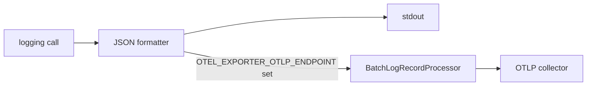

# 0007. Emit structured JSON logs to stdout as the only observability signal, with optional OTLP export

## Status

Accepted

## Context

The template needed some way for an operator to see what the app is
doing, in a form both greppable locally and ingestible by a log
aggregator in a real deployment. Full OpenTelemetry instrumentation —
traces and metrics alongside logs — was the other option on the table,
since the `opentelemetry` packages already used for the OTLP log bridge
support all three signals. Only logs were asked for, and adding
tracing/metrics instrumentation on spec, with no consumer or requirement
driving it, would mean maintaining SDK setup and dependencies for
signals nothing in this template (or its README, its tests, its ADRs)
actually needs yet.

A related question was where OTLP's own configuration (endpoint,
headers, protocol, compression, certificate) should live: re-modeled as
typed fields on `app.config.Settings`, matching how every other setting
in this app is read, or left to OpenTelemetry's own environment-variable
convention.

## Decision

We will log structured JSON to stdout unconditionally
(`telemetry.configure_logging()`, called once from `main.py` at import
time) — every log call, including uvicorn's own, becomes one JSON line
with `timestamp`, `level`, `logger`, `message`, arbitrary extras, and
exception info when present. When `OTEL_EXPORTER_OTLP_ENDPOINT` is set,
the same root logger is additionally bridged to an OTLP log exporter via
a batched processor; when it's unset, no OTLP code path runs at all.

We will read OTEL's own environment variables directly in
`OTLPLogExporter()` rather than re-modeling them as `Settings` fields —
OTEL's env-var convention is already the single, vendor-neutral source
of truth for that configuration, and duplicating it as app settings
would just be a second place those values could drift out of sync.

We will not add tracing or metrics instrumentation until something
actually needs it — this is a deliberate scope limit, not an oversight,
recorded here so a future contributor doesn't have to guess whether it
was considered.

## Consequences

Every environment — local devcontainer, CI, or a real deployment — gets
the same structured log format for free, parseable the same way whether
piped through `jq` locally or ingested by a log aggregator in
production; enabling OTLP export is a single environment variable, not
a code change. The cost is that this app currently has no distributed
tracing and no metrics: a performance problem that would show up as an
obvious slow span in a trace has to be diagnosed from logs and
inference instead. If tracing or metrics become genuinely needed, that
should be a new ADR (or a status update superseding parts of this one),
not a silent addition — the `opentelemetry` SDK already in this app's
dependencies supports both, but neither is wired up today.
