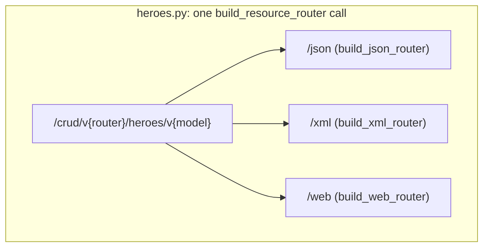

# 0009. Separate router-engine version, resource-shape version, and format into explicit path segments

## Status

Accepted

## Context

`0002` versioned the Hero API by a single `/vN` path prefix: `/v2/heroes*`
current, `/v1/heroes*` deprecated. That prefix has always conflated two
independent things. First, the version of the *generic CRUD router
factories* in `controllers/crud_router.py` (`build_json_router`/
`build_xml_router`/`build_web_router`) — their route shape and behavior,
which has in fact never changed since `0001`. Second, the version of the
*Hero resource's shape* (`HeroV1` vs. the current, but unversioned-in-name,
`Hero`/`HeroCreate`/`HeroUpdate`). A future breaking change to the router
factories themselves (e.g. moving id addressing off the query string) would
have no path segment of its own to land in without also looking like a Hero
shape change.

Format (JSON vs. XML vs. web) was distinguished only by an internal
`/xml`/`/form`/`/components.js` path fragment appended at the resource
level, with JSON as an implicit, unlabeled default — not a uniform segment
applied the same way across every format. Combined with the two conflated
version axes, each resource-version ended up spread across three sibling
controller modules (`heroes.py`/`heroes_xml.py`/`heroes_web.py`, doubled
for the `_v1` siblings: six files for one resource), each independently
calling `build_json_router`/`build_xml_router`/`build_web_router` and
hand-computing its own prefix.

Two shapes for the path were on the table. Keep the single `/vN` prefix
and accept the conflation, documenting by convention which axis a given
digit belongs to — cheaper to write, but leaves no room to version the
router engine independently of a resource's shape, and the format
inconsistency (JSON unlabeled, XML/web labeled) remains. Or: three
explicit segments, one per axis (`/crud/v{router}/heroes/v{model}/{format}`),
uniformly applied including JSON. The second was chosen — it costs one
more segment per path but removes the ambiguity permanently, and lets a
resource-version's three per-format controllers collapse into one file
built by a single composing factory (see Decision).

## Decision

We will version a resource's routes along three independent, explicit
path segments, in this order: `/crud/v{router_version}/heroes/v{model_version}/{format}`
— e.g. `/crud/v1/heroes/v2/json`, `/crud/v1/heroes/v1/xml`,
`/crud/v1/heroes/v2/web/form`. Format comes *last*, not between the two
version segments, specifically so one resource-version's JSON/XML/web
routes can be built as sub-routers of a single combined `APIRouter` (each
included at its own `/{format}` sub-prefix) and mounted with one
`include_router` call.

Every format gets an explicit segment, JSON included (`/json`, not a bare
default) — uniform across all three, matching `/xml`/`/web` rather than
special-casing JSON as the unlabeled default. `0002`'s "no bare alias, callers
pick a version explicitly" rule already applied to `model_version`; this
extends the same rule to `router_version` and to `format`.

`router_version` names a version of `crud_router.py`'s own factories (their
route shape/behavior), never a resource's shape. It stays `1` for every
existing route, since the factories haven't changed, and only increments
when `build_json_router`/`build_xml_router`/`build_web_router`'s own
behavior changes in a breaking way. It's defined once, as `ROUTER_VERSION`
in `crud_router.py`, that resource controllers import into their prefix
rather than each hardcoding `"v1"` independently.

Everything `0002` decided about the *resource-shape* axis carries forward
unchanged: the DB model (`models/hero.py`) stays unversioned and represents
only the current shape; a deprecated resource version is a `views` + `crud`
concern (`*_vN.py` views module, `CompatCRUD` wrapper), never a second
table; only `app.views` classes carry a numeric suffix, so the DB model's
name never changes just because view classes now do. Following that
symmetry, the current (latest) Hero views also gain the `V2` suffix
(`HeroV2`/`HeroV2Base`/`HeroV2Create`/`HeroV2Update` in `views/hero_v2.py`,
replacing the unsuffixed `Hero*` in `views/hero.py`) — the same views a
deprecated `HeroV1*` sibling already names explicitly.

A resource-version is built as one combined `APIRouter` from a single new
factory, `crud_router.py`'s `build_resource_router`, replacing today's
one-controller-module-per-format layout:

```python
def build_resource_router(*, prefix: str, ...) -> APIRouter:
    router = APIRouter(prefix=prefix, tags=tags, dependencies=list(router_dependencies))
    router.include_router(build_json_router(prefix="", ...), prefix="/json")
    router.include_router(build_xml_router(prefix="", ...), prefix="/xml")
    router.include_router(build_web_router(prefix="", ...), prefix="/web")
    return router
```

`router_dependencies` (used for `0002`'s per-deprecated-version
`sunset(...)` header) is applied once, on the outer router's own
constructor — FastAPI merges a router's own `dependencies` into every
route of every sub-router later `include_router`'d into it, so this one
declaration reaches JSON/XML/web alike, instead of each per-format factory
call repeating it. `build_web_router`'s `api_base` (used to point the
rendered form at the JSON API) becomes `f"{prefix}/json"`, computed once
from the same `prefix` argument passed to `build_resource_router`, rather
than a separately-passed string that can drift from the router's actual
JSON path. Because the combined router carries its own full prefix, a
resource-version's controller module is mounted with a bare
`app.include_router(router)` in `main.py` — no prefix computed at the
mount site.

`build_json_router`/`build_xml_router`/`build_web_router` themselves are
unchanged — `build_resource_router` is a thin composition on top, so each
remains independently usable (and independently tested) for a resource
that genuinely only needs one format.

Each resource-version collapses to one controller module: `heroes.py`
(`/crud/v1/heroes/v2/*`) and `heroes_v1.py` (`/crud/v1/heroes/v1/*`,
`CompatCRUD`-wrapped as before), replacing six files with two.



## Consequences

A resource-version is now one controller file and one `include_router`
call in `main.py`, not three of each — adding a new deprecated version
(the `0002` payoff this ADR keeps) costs one views module and one
controller module, not three. Every path segment is unambiguous about
which axis changed: bumping `ROUTER_VERSION` never gets confused with a
resource shape change, and vice versa.

The cost is a longer, more segmented URL (`/crud/v1/heroes/v2/json`
instead of `/v2/heroes`) for every existing caller, format included —
this is a breaking change to every current route path, not just an
additive one, so every existing client, test, and doc reference needed
updating in the same change that introduced the new shape (no transition
period or bare-alias fallback, consistent with `0002`'s "no bare alias"
rule now applied to all three axes). `router_version` is very unlikely to
ever be anything but `1` in practice (the router factories are generic and
resource-agnostic by design), so most of the time that segment is
inert ceremony — a cost accepted deliberately so the *rare* breaking
change to the router engine itself has an obvious place to land, instead
of forcing another prefix renegotiation later.
