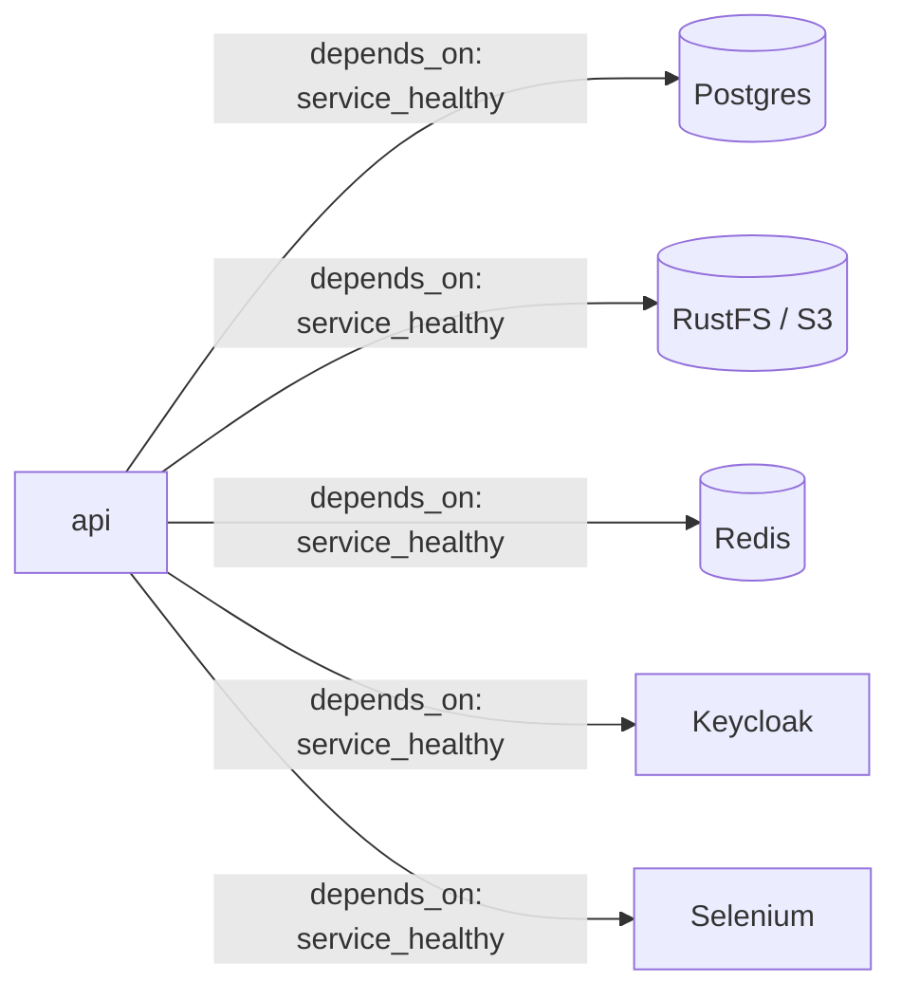
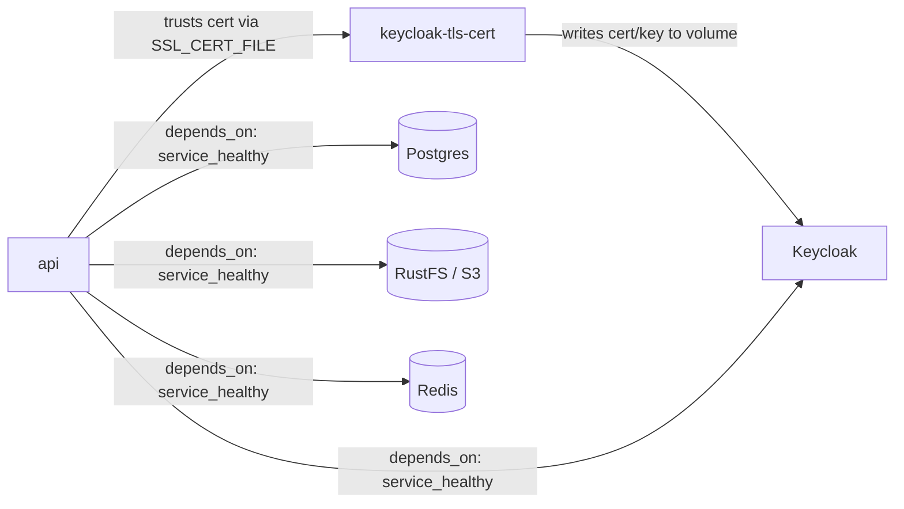

# Architecture

Infrastructure/deployment view of the system: the `api` service and the
supporting services it depends on, how they connect, and how the
devcontainer's stack differs from the repo-root smoke-test stack. For
the application's own internal layering and request flow, see
[system-design.md](system-design.md).

## Devcontainer stack

`.devcontainer/compose.yml` builds `api` from the `Dockerfile`'s
`develop` stage and pulls in every supporting service via its
`include:` list (each fragment under
[.devcontainer/stack/](../.devcontainer/stack/)): Postgres (primary
database), RustFS (S3-compatible object storage), Redis (cache/queue/
pub-sub), Keycloak (OIDC identity provider), and Selenium (a remote
browser Playwright drives for the e2e suite). `api` declares a
`depends_on: <service>: condition: service_healthy` entry for each one,
so Compose won't start `api` until every dependency's own healthcheck
passes — see
[.devcontainer/stack/README.md](../.devcontainer/stack/README.md)'s
"Devcontainer stack pattern" section for why.

No fragment declares a `networks:` block — every service already
reaches every other one by its service name on the default network
Compose generates for this project. None declares a `ports:` mapping
either: these are backend services meant to be reached only from other
containers. Keycloak is the one service a developer also needs from a
host browser (its login/admin UI), so its port is forwarded via
`forwardPorts`/`portsAttributes` in `.devcontainer/devcontainer.json`
instead of a compose `ports:` entry — the Dev Containers spec forwards
a container's port directly from its network namespace, without
publishing it via Compose. `api`'s own `:8000` is forwarded the same
way, for the same reason.

| Service   | Container-internal port(s) | Host-forwarded?                     |
| --------- | --------------------------- | ------------------------------------ |
| `api`     | 8000                         | yes — `forwardPorts` (devcontainer)  |
| postgres  | 5432                         | no                                    |
| s3        | 9000 (API), 9001 (console)  | no                                    |
| redis     | 6379                         | no                                    |
| keycloak  | 8080                         | yes — `forwardPorts` (login/admin UI) |
| selenium  | 4444                         | no                                    |

`api` loads each stack service's own local-dev-only credentials via
`env_file:` (the same per-service `<service>.env` files each fragment
loads itself — never re-pinned a second time), plus a handful of fixed
in-network hostname/port literals (`POSTGRES_HOST`, `S3_ENDPOINT_URL`,
`REDIS_URL`) since those are addresses, not credentials. See
[.devcontainer/stack/README.md](../.devcontainer/stack/README.md)'s
"Configuration" section for the full chain, and
[src/app/README.md](../src/app/README.md)'s "Configuration" section for
how `app.config` assembles those raw values into the settings the app
reads.

## Runner-image smoke-test stack

The repo-root [compose.yml](../compose.yml) is a separate, narrower
stack used only for CI's smoke test
([.github/workflows/README.md](../.github/workflows/README.md)'s
`smoke.yml` entry): it builds `api` from the `runner` stage instead of
`develop`, uses the same Postgres/S3/Keycloak/Redis fragments but
leaves out Selenium (nothing here needs a browser driver), and runs
with no `MODE` override so the `runner` stage's own `MODE=production`
default is what gets exercised.

Running `MODE=production` for real means also satisfying
`src/app/config.py`'s production-only guardrails, which the shared
`.devcontainer/stack/` fragments' local-dev defaults don't: Postgres/S3
credentials can't be left at those defaults, and `oidc_issuer_url` must
be `https://`. Postgres and S3 get smoke-test-only credential overrides;
Keycloak gets a self-signed cert (generated by the one-shot
`keycloak-tls-cert` service into a shared `keycloak-tls` volume) so it
can serve HTTPS, with `api`'s `SSL_CERT_FILE` pointed at that same cert
so its OIDC health check trusts it. None of this touches the
`.devcontainer/stack/` fragments themselves — the devcontainer's own
stack keeps its plain-HTTP Keycloak and shared local-dev credentials
unchanged, since `.devcontainer/compose.yml` runs `MODE=dev`/`mock`,
which don't have these guardrails. Postgres/S3/Keycloak are pulled in
via `extends:` (not `include:`) specifically so these overrides are
possible — `include:` errors on any field conflict with an included
service instead of merging.

Unlike every devcontainer fragment, this file *does* publish a port —
`api`'s `8000:8000` — because it exists to be curled from the GitHub
Actions runner (the host), not from a sibling container. Its
healthcheck shells out to the venv's own Python (`urllib.request`)
rather than `curl`/`wget`, since the `runner` image's slim base
installs neither.

## Do

- Base any change to this document's diagram on
  [.devcontainer/stack/README.md](../.devcontainer/stack/README.md),
  [.devcontainer/compose.yml](../.devcontainer/compose.yml), the
  repo-root [compose.yml](../compose.yml), and each stack service's own
  `README.md` — not on assumptions about what a service does.

## Don't

- Restate a stack service's connection details (credentials, exact
  image tag) here — those live in that service's own `README.md` under
  `.devcontainer/stack/`, which stays the single source of truth.
