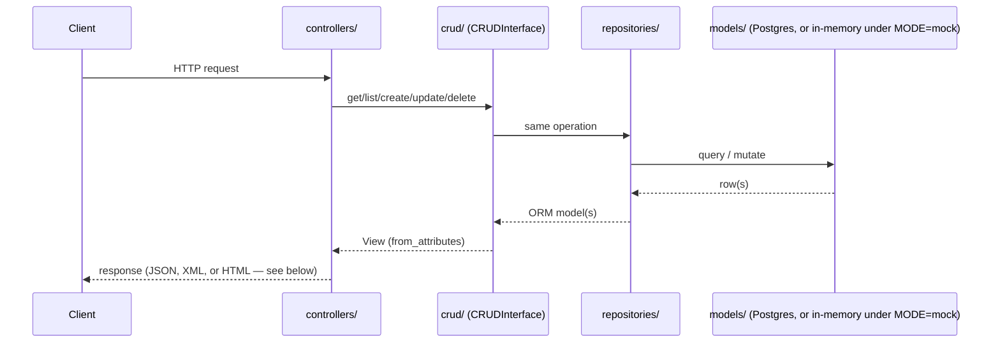

# System design

Application-level view of `src/app/`: layering, request flow, the
multi-format representation pattern, and auth. For the infrastructure/
deployment view (services, networking, healthchecks), see
[architecture.md](architecture.md). This is a summary that must stay
consistent with [src/app/README.md](../src/app/README.md)'s own
"Layering" section and diagram, which remain authoritative for the
exact import order.

## Layering

`src/app/` is laid out as an MVC-ish split, plus supporting layers, all
under one strict, one-directional import order — a lower layer never
imports from a higher one, enforced by `import-linter` in CI (see
[docs/adrs/0001](adrs/0001-mvc-layering-with-a-generic-crud-interface.md)):

- `models/` — the Model layer: SQLAlchemy ORM.
- `views/` — the View layer: Pydantic schemas, converting to/from the
  ORM model purely through `from_attributes` (`ORMView`), with no
  resource-specific code in the layers below it.
- `repositories/` — a storage-agnostic `Repository` protocol
  (`SQLAlchemyRepository` in `dev`/`production`, `InMemoryRepository`
  under `MODE=mock`).
- `crud/` — `CRUDInterface`, generic over a view and a repository; adding
  a resource needs only a model, a view, and a controller, never new
  CRUD code.
- `controllers/` — the Controller layer: FastAPI routers, the highest
  layer, may import from any other subpackage.
- `health/` — the health check interface and registry, run by
  `/health/ready`.

`config.py`/`telemetry.py`/`problem_details.py`/`oidc.py`/
`http_headers.py`/`xml_codec.py`/`web_components.py`/`main.py` stay flat,
outside any subpackage. See
[src/app/README.md](../src/app/README.md) for what each one does.

## Request flow

A resource's CRUD routes are one declarative call each
(`build_json_router`/`build_xml_router`/`build_web_router` in
`controllers/crud_router.py`), sharing the same underlying
`CRUDInterface`/`CRUDLike` dependency regardless of format:

See [src/app/README.md](../src/app/README.md)'s "Example CRUD resource:
Hero" for the same flow worked through a concrete resource.

## Multi-format sibling routers

A resource's XML and HTML/web-form representations are exposed as
sibling routes (`/heroes`, `/heroes/xml`, `/heroes/form`) built by
dedicated router factories, rather than by content negotiation inside
one route — each format shares the same `CRUDLike` dependency, so none
can drift in what data it exposes or what validation it applies. See
[docs/adrs/0005](adrs/0005-multi-format-representations-via-sibling-routers.md)
and [src/app/controllers/README.md](../src/app/controllers/README.md)'s
"Multi-format CRUD"/"Generic CRUD router factories" sections for the
mechanics.

## Auth

Routes opt into auth with `Depends(get_current_claims)`
(`oidc.py`); a route with no such dependency is public. Authorization
(`require_roles(...)`) is enforced server-side, per backend, reading
Keycloak's `resource_access.<client>.roles` claim — never delegated to
a frontend, which can only ever hide UI as a convenience. See
[docs/adrs/0003](adrs/0003-auth-strategy-and-federated-backends.md).

`Settings.mode` (`MODE`: `dev`/`mock`/`production`) drives every
infrastructure fake from one setting instead of per-subsystem toggles:
`MODE=mock` swaps in `InMemoryRepository`, `MockHealthCheck`, and
claims-trusting auth (plus a `POST /mock/token` route), so the full
controller/CRUD stack runs with zero containers. See
[docs/adrs/0006](adrs/0006-mode-driven-fakes-for-infrastructure-free-testing.md)
and [src/app/README.md](../src/app/README.md)'s "MODE (dev / mock /
production)" section.

## Do

- Base any change to this document on
  [src/README.md](../src/README.md)/
  [src/app/README.md](../src/app/README.md) and its subpackage
  `README.md`s — those stay authoritative for exact layering and
  mechanics; this document is the higher-level summary.
- Link to the relevant ADR in [docs/adrs/](adrs/) instead of restating
  its reasoning here.

## Don't

- Duplicate a subpackage `README.md`'s implementation detail here —
  summarize and link instead.
